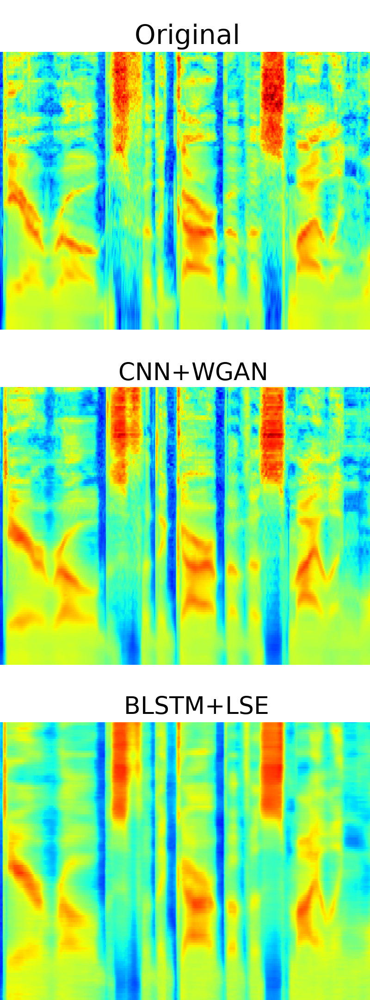

## Percival: CNN-WGAN acoustic model for text-to-speech synthesis



<br/><br/>

Based on Python/TensorFlow/Keras, using Wasserstein GAN and training
regularization to optimise 2D convolutional layers.

It uses [festival](http://festvox.org/festival/) and [Merlin](https://github.com/CSTR-Edinburgh/merlin) scripts to generate
the input text labels. The [PML vocoder](https://github.com/gillesdegottex/pulsemodel) is used for the waveform synthesis.

<br/><br/>

### Inspired by

Wasserstein GAN [article](https://arxiv.org/abs/1701.07875)

    https://github.com/eriklindernoren/Keras-GAN/blob/master/wgan_gp/wgan_gp.py
    https://github.com/keras-team/keras-contrib/blob/master/examples/improved_wgan.py
    https://gist.github.com/f0k/f3190ebba6c53887d598d03119ca2066
    https://github.com/martinarjovsky/WassersteinGAN
    https://github.com/fairytale0011/Conditional-WassersteinGAN
    http://blog.richardweiss.org/2017/07/21/conditional-wasserstein-gan.html

Improved training for Wasserstein GAN [article](https://arxiv.org/abs/1704.00028)

    https://github.com/tjwei/GANotebooks/blob/master/wgan2-lasagne.ipynb
    https://github.com/ririw/ririw.github.io/blob/master/assets/conditional-wasserstein-gans/Improved.ipynb

Least Square mixing [article](https://arxiv.org/abs/1611.07004)

PixelCNN [article](https://arxiv.org/abs/1606.05328)

    https://arxiv.org/pdf/1704.03809.pdf
    http://www.dtic.upf.edu/~mblaauw/MdM_NIPS_seminar/

<br/><br/>

### Legal

Copyright(C) 2017 Engineering Department, University of Cambridge, UK.

The code in this repository is released under the Apache License, Version 2.0.
Please see LICENSE.md file for more details.

All source files of any kind (code source and any ressources), except the
content of the 'external' directory, are under the same license. Please refer
to the content of the 'external' directory for the legal issues related to those
code source.

This project has received funding from the European Union's Horizon 2020
research and innovation programme under the Marie Skłodowska-Curie grant
agreement No 655764.

### Disclaimer

THIS SOFTWARE IS PROVIDED BY THE COPYRIGHT HOLDERS AND CONTRIBUTORS "AS IS"
AND ANY EXPRESS OR IMPLIED WARRANTIES, INCLUDING, BUT NOT LIMITED TO, THE
IMPLIED WARRANTIES OF MERCHANTABILITY AND FITNESS FOR A PARTICULAR PURPOSE
ARE DISCLAIMED. IN NO EVENT SHALL THE COPYRIGHT OWNER OR CONTRIBUTORS BE
LIABLE FOR ANY DIRECT, INDIRECT, INCIDENTAL, SPECIAL, EXEMPLARY, OR
CONSEQUENTIAL DAMAGES (INCLUDING, BUT NOT LIMITED TO, PROCUREMENT OF
SUBSTITUTE GOODS OR SERVICES; LOSS OF USE, DATA, OR PROFITS; OR BUSINESS
INTERRUPTION) HOWEVER CAUSED AND ON ANY THEORY OF LIABILITY, WHETHER IN
CONTRACT, STRICT LIABILITY, OR TORT (INCLUDING NEGLIGENCE OR OTHERWISE)
ARISING IN ANY WAY OUT OF THE USE OF THIS SOFTWARE, EVEN IF ADVISED OF THE
POSSIBILITY OF SUCH DAMAGE.
ALSO, THE COPYRIGHT HOLDERS AND CONTRIBUTORS DO NOT TAKE ANY LEGAL
RESPONSIBILITY REGARDING THE IMPLEMENTATIONS OF THE PROCESSING TECHNIQUES
OR ALGORITHMS (E.G. CONSEQUENCES OF BUGS OR ERRONEOUS IMPLEMENTATIONS).

<br/>

### Dependencies and working versions

Percival is _not_ a standalone pipeline for TTS. It only trains an acoustic
model. Technically, it is dependent on a text-to-audio alignment system, which
usually provides context input labels (e.g. in HTS format; as `label_state_align`
directory in Merlin).

Dealing with the numerous dependencies between the libraries and tools can also
be a nightmare. We strongly suggest to use a package manager
[conda](https://conda.io/docs/) or [miniconda](https://conda.io/miniconda.html)
on top of the OS package manager. Here are versions that are known to work using
miniconda:
```
# Name                    Version                   Build  Channel
_tflow_190_select         0.0.1                       gpu
bandmat                   0.6                       <pip>
blas                      1.0                         mkl
cudatoolkit               9.0                  h13b8566_0
cudnn                     7.1.2                 cuda9.0_0
cupti                     9.0.176                       0
cython                    0.28.2           py27h14c3975_0
defusedxml                0.5.0                     <pip>
gcc_impl_linux-64         7.2.0                habb00fd_3
gcc_linux-64              7.2.0                        26
gxx_impl_linux-64         7.2.0                hdf63c60_3
gxx_linux-64              7.2.0                        26
intel-openmp              2018.0.0                      8
keras                     2.2.2                         0
keras-applications        1.0.4                    py27_1
keras-base                2.2.2                    py27_0
keras-preprocessing       1.0.2                    py27_1
kiwisolver                1.0.1            py27hc15e7b5_0
libffi                    3.2.1                hd88cf55_4
libgcc-ng                 7.2.0                h7cc24e2_2
libgfortran-ng            7.2.0                hdf63c60_3
libgpuarray               0.7.5                h14c3975_0
libopenblas               0.2.20               h9ac9557_7
libstdcxx-ng              7.2.0                h7a57d05_2
matplotlib                2.2.2            py27h0e671d2_1
mkl                       2018.0.2                      1
mkl-service               1.1.2            py27hb2d42c5_4
mkl_fft                   1.0.1            py27h3010b51_0
mkl_random                1.0.1            py27h629b387_0
numpy                     1.14.3           py27h28100ab_1
numpy-base                1.14.3           py27h0ea5e3f_1
py-cpuinfo                4.0.0                     <pip>
pygpu                     0.7.5            py27h14c3975_0
python                    2.7.14              h1571d57_29
scipy                     1.1.0            py27hfc37229_0
sip                       4.19.8           py27hf484d3e_0
subprocess32              3.2.7            py27h373dbce_0
tensorboard               1.9.0            py27hf484d3e_0
tensorflow                1.9.0           gpu_py27hd3a791e_1
tensorflow-base           1.9.0           gpu_py27h6ecc378_0
tensorflow-gpu            1.9.0                hf154084_0
tensorflow-gpu-base       1.7.0            py27h8a131e3_0
termcolor                 1.1.0                    py27_1
theano                    1.0.1            py27h6bb024c_0
```
Some packages are not available in conda directly, so install pip in your
conda, activate the environment and then install also:
```
pip install defusedxml bandmat
```
And other version numbers
```
CUDA                      9.0
NVidia Drivers            384.111
```

To apply post-processing for formant enhancement, you need to have `mcep` command line from [SPTK](http://sp-tk.sourceforge.net/)
By default, un-post-processed and post-processed samples are generated in the `out` directory.


### Install and run the demo

First clone the git repository:
```
$ git clone https://gitlab.com/gillesdegottex/percivaltts.git
```
Then, go into the repository directory and compile the various tools neccessary
to run Percival:
```
$ cd percivaltts
$ make build
```

Download the demo data:
```
$ make tests/slt_arctic_merlin_full
```

Go into the `percivaltts` python module directory:
```
$ cd percivaltts
```

Edit `setenv.sh` according to your TensorFlow/Keras installation (see above).

And finally run the demo!
```
$ make run
```

[A web page with the expected demonstration samples can be found here](http://gillesdegottex.eu/Demos/PercivalTTS/compare_percival_0.9.5/)

### Preparing a new voice
Like in Merlin, you basically need the three following elements from any corpus:
* `label_state_align`

    The same directory that is imported in Merlin. It is produced by an
    alignement tool, as in HTS. Merlin provides the necessary scripts for
    generating the text labels from text inputs and align these text labels on
    some given waveform.

    Phone aligned labels can also be used. In this case you have to pass
    `subphone_feats='coarse_coding'` to HTSLabelNormalisation constructor and
    pass `label_type='phone_align'` to `label_normaliser.perform_normalisation`

* `wav`

    The waveforms directory aligned with the labels above

* `file_id_list.scp`

    The same file that you find in Merlin, which contains the basenames of each
    file in `label_state_align` and `wav`.    

Put this somehwere in a common directory and point the `cp` variable in the
`run.py` file to this directory.


### Formats

The are a few assumptions across the code about data formats.

First, floating point precision values are always saved on disc using the `float32` format.

#### Data set
The basenames of the corpus files are listed in a file (e.g. file_id_list.scp).
This list is then split into [traning; validation; test] sets, always in this order.
The validation start starts at `id_valid_start` and contains `id_valid_nb` files.
The test set directly follows the validation set and contains `id_test_nb`.

Because the size of the training set is always an interger multiple of the batch size, the training set might have less than `id_valid_start` files.
The `id_valid_start-1` last files right before `id_valid_start` might thus be completely ignored by the training process.

A last set exists, the demo set, which is a subset of the test set. This is convenient for generating and listening quickly to a few known sentences after a training. By default it is the first 10 sentences of the test set.
`id_test_demostart` can be used to select the starting index (relative to the test set) in order to chose where the demo set starts within the test set.

During training, percival uses batches that have a small time window (2sec by default). Thus, when a sentences is picked for training, only this time window is used.
There is two main advantage of this data formating: i) the memory size on the GPU is dependent on the duration of this time window and not on the random selection of the sentences; ii) each batch is full, in the sense that it doesn't need any zero padding at the end of short sentences, which means that masks are neither necessary.
However, an epoch is not a full epoch in the sense that it does _not_ see all of the training data. This explains why the number of "epoch" is quite huge (300) by default in order to compensate for the unseen data.

#### File access and shapes
To represent multiple files in a directory, file paths are usually defined with a wildcard (e.g. `waveforms/*.wav`).
Because input and output data of the network (lab and cmp files) are saved in raw `float32` format, without header, it is not possible to know the actual dimensions of the data
inside each file.
In Percival, the trick is to specify the shape of the data as a suffix of the file path, e.g. `spectrum/*.spec:(-1,129)`. this suffix will be used, as is, to reshape the numpy array using `np.reshape(.)`.

#### Batches

A batch has a shape: [size, length, features_dim], that represent the number of samples in the batches, the number of time frames in the batch and the feature dimensionality, respectively. Because TensorFlow/Keras needs a "channel" dimension (as in pictures), batches' shape often become temporarily [size, 1, length, features_dim] so that the last two dimensions define a picture of size [length, features_dim].

#### Features order

The implementation of the models assume the following features order: f0, amplitude spectrum (spec), noise (e.g. aperiodicity noise mask), vuv.

### Results repeatability

The seed of the random number generator is forced by default.
In order to have non-deterministic runs, replace the content of the function `numpy_force_random_seed` in utils.py by `pass`
https://keras.io/getting-started/faq/#how-can-i-obtain-reproducible-results-using-keras-during-development

When the seed is forced, and while using the CPU, all training runs are supposed to output the exact same numerical results, no matter the model.

When using the GPU, the runs are usually NOT repeatable and thus output different results.


### Training optimisation

Even though WGAN is more robust than the original GAN, there are still a few elements to verify to be sure a training went well.
1) The `discri_training` has to be higher than zero. If it goes negative, it surely means the either the critic or the generator converges too fast.
2) `model_training_wgan_lse_ratio` is the ratio between the WGAN loss and the LSE loss. If it goes very close to zero, it means the LSE loss is drowning the WGAN loss. In such a case, you  might want to decrease `cfg.train_LScoef` closer to zero.
3) if `discri_validation` doesn't decrease overall over the end of your training, it might be that you should run your training longer.


### Cloning

Managing multiple experiments in parallel, fixing bugs and try new ideas while keeping track of all the changes this can imply can become quite problematic. In Percival, there is a simple script `clone.sh` that allows you to clone the whole code source and place it in an experiment directory:
```
$ ./clone.sh /path/to/experiment1
```
or clone and run the `run.py` script file directly:
```
$ ./clone.sh /path/to/experiment1 bash ../percivaltts/setenv.sh python ../percivaltts/run.py
```
when a script is runned using `clone.sh`, the working directory is `/path/to/experiment1/out` so that all of the experiment results are in this `out` sub-directory and all the code is in a separate sub-directory `percivaltts`.
You can also replace the `bash` command by a script for submitting the job to a Sun Grid Engine (SGE).
The `Makefile` has also all the corresponding commands (clone, run, clone_run_grid, etc.)


### Author/Contributor
Gilles Degottex <gad27@cam.ac.uk>

### Contact
To raise bug reports, questions, suggestions, etc. please use the [issue managment](https://gitlab.com/gillesdegottex/dfasma/issues) only.
